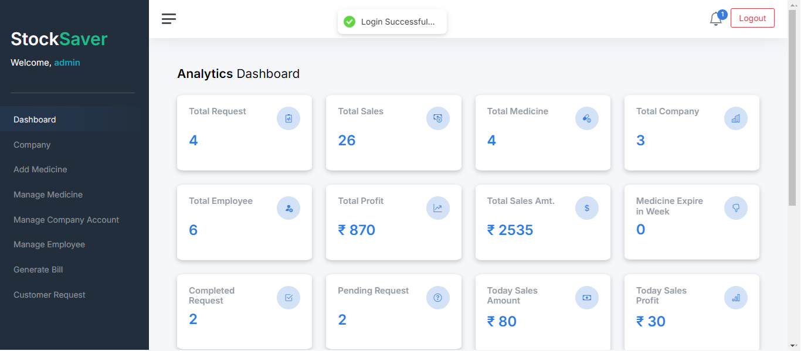
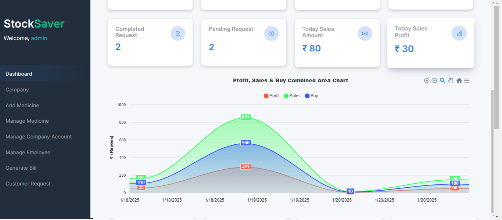

<h1 align="center" id="title">StockSaver - Medical Stock Management System</h1>

<p id="description">StockSaver is a Medical Stock Management System built to streamline the day-to-day operations of medical stores. This system helps medical store owners efficiently manage stock inventory, sales, customer and supplier information, and billing processes. The system provides real-time reporting, automated restocking alerts, and seamless payment processing through Stripe integration. It helps medical stores reduce manual work and enhances customer service through a reliable, secure, and user-friendly interface.</p>

<p align="center">
  
  
  
  
  
  
  
  
</p>

## 📺 Preview

<p align="center">
  
  
</p>

## 🫂 Contributors

We are grateful for the contributions of the following individuals who helped make StockSaver a reality:

- 👤 [Deep Adhikary](https://github.com/DAdhikary06)
- 👤 [Chandrasekhar Roy](https://github.com/chandraSekharRoy001)
- 👤 [Amrapali Chakraborty](https://github.com/amrapali2002)
- 👤 [Prasam Kundu](https://github.com/PrasamK02) 

## 📝 Table of Contents

- [Introduction](#introduction)
- [Features](#features)
- [Technologies Used](#technologies-used)
- [Installation](#installation)
- [Usage](#usage)
- [Contributing](#contributing)
- [License](#license)

## 😊 Introduction
StockSaver is a Medical Stock Management System designed to streamline and automate the operations of medical stores. It helps store owners efficiently manage inventory, sales, and customer information. The system also supports secure payments through Stripe and provides real-time data visualization for sales and stock levels using ApexCharts.

## 🤩 Features
- **Automated Stock Management**: Tracks inventory levels and alerts users when stock is low.
- **Admin Dashboard**: Provides a real-time overview of sales, stock levels, and customer orders.
- **Customer Billing**: Allows admins to generate bills for customers, listing the purchased items and total amounts.
- **Payment Integration**: Secure payment gateway integration with Stripe.
- **Reports & Analytics**: Real-time sales, stock, and profit reports using ApexCharts.
- **JWT Authentication**: Secure authentication system with role-based access.
- **Responsive UI**: User-friendly interface built with React.js.

## 🤯 Technologies Used
- **Backend**: Django, Django Rest Framework (DRF)
- **Frontend**: React.js
- **Database**: SQLite3
- **Authentication**: JWT (JSON Web Tokens)
- **Payment Gateway**: Stripe
- **Charts**: ApexCharts

## 🤖 Frontend Setup 

### Installation

### Prerequisites

Before setting up the frontend, make sure you have the following installed:

- **Node.js** (Ensure that you have **Node.js** and **npm** installed in your machine)
  - You can download Node.js from [here](https://nodejs.org/).
  - After installation, verify by running the following commands in your terminal/command prompt:
    ```bash
    node -v
    npm -v
    ```

- **Git**: To clone the repository, ensure you have Git installed. You can download it from [here](https://git-scm.com/downloads).

### Steps to Set Up the Frontend

1. Clone the repository:
   ```bash
   git clone https://github.com/DAdhikary06/StocksaverFrontend
   cd StocksaverFrontend

  
2. **Install frontend dependencies:**

   ```bash
   npm install
   ```

3. **Start the frontend server:**

   ```bash
   npm run dev
   ```

The application will be available at `http://localhost:5173`.


## ⚙️ Backend Setup

### Repository Link

The backend code for StockSaver can be found at the following GitHub repository:

- [StockSaver Backend Repository](https://github.com/DAdhikary06/StocksaverBackend)

### Prerequisites

Before setting up the backend, ensure you have the following installed:

- **Python** (version 3.6 or higher)
- **pip** (Python package installer)
- **Virtualenv** (optional but recommended for creating isolated environments)

### Steps to Set Up the Backend

1. Clone the backend repository:
   ```bash
   git clone https://github.com/DAdhikary06/StocksaverBackend
   cd StocksaverBackend
   ```
2. Create a virtual environment (optional):
  ```bash
  python -m venv venv
  source venv/bin/activate  # On Windows use `venv\Scripts\activate
  ```
3. Install backend dependencies:
  ```bash
  pip install -r requirements.txt
  ```
4. **Set up environment variables:** Create a `.env` file in the `backend` directory and add these:

   ```markdown
   EMAIL_HOST_USER = <your_host_email_id>
   EMAIL_HOST_PASSWORD = <your_host_password>
   STRIPE_TEST_SECRET_KEY = <enter_stripe_secret_key>
   STRIPE_TEST_PUBLISHABLE_KEY = <enter_stripe_publishable_key>
   SECRET_KEY=<enter_django_secrect_key>
   ```
5. Run database migrations:

  ```bash
  python manage.py migrate
  ```
6. Start the backend server:

  ```bash
  python manage.py runserver
  ```
The backend will be available at http://localhost:8000.

## 😱 Usage

Once the system is running, admins can:

### For **Admins**:

- **Login to the Admin Dashboard**:  
  Admins can log in using their credentials and access the dashboard.

- **Manage Medicines**:  
  Admins can add, edit, or delete medicines. They can update stock, prices, and descriptions.

- **Manage Company**:  
  Admins can add, edit, or delete company details. They can also view company contact information.

- **Manage Company Bank Account**:  
  Admins can add, edit, or delete company bank account details.

- **View Stock Alerts**:  
  The system sends alerts when stock is low. Admins can reorder medicines as needed.

- **Manage Orders**:  
  Admins can view all customer orders. They can track order status and update orders accordingly.

- **Generate Reports**:  
  Admins can create reports on sales, profits, and stock levels.

- **Manage Customers and Employees**:  
  Admins can view customer and employee details, including contact information.

- **Manage Employee Salaries**:  
  Admins can view employee salary information and update their salary records. They can also pay employees through the system.

- **Send Notifications**:  
  Admins can send email notifications to customers or admins for registration, password resets, and order updates.

- **Handle Payments**:  
  Admins can view payment statuses for all orders. Payments are processed securely via **Stripe**.

- **Generate Bills for Customers**:  
  Admins can generate and send bills to customers for their orders.

- **Monitor Profit and Sales Reports**:  
  Admins can view detailed reports on store profits and sales performance to make informed business decisions.

### Key Features for Admins:

- **Real-time Stock Management**:  
  Admins can see current stock levels and get alerts when restocking is needed.

- **Secure Payment Processing**:  
  Admins can view payment transactions via **Stripe**.

- **Easy Order and Billing Management**:  
  Admins can manage customer orders and generate bills.

- **Generate Graphical Reports**:  
  Admins can use **ApexCharts** to visualize sales and stock data.

With **StockSaver**, admins can easily manage store operations, from inventory to customer orders, payments, and reporting.


## 🙏 Contributing

We welcome contributions to StockSaver! If you have any ideas, suggestions, or bug reports, please open an issue or submit a pull request.

### Steps to Contribute:

1. **Fork the repository**

2. **Create a new branch:**

   ```bash
   git checkout -b feature/your-feature-name
   ```

3. **Make your changes**

4. **Commit your changes:**

   ```bash
   git commit -m 'Add some feature'
   ```

5. **Push to the branch:**

   ```bash
   git push origin feature/your-feature-name
   ```

6. **Open a pull request**

## 📃 License

This project is licensed under the MIT License. See the [LICENSE](LICENSE) file for more details.

Thank you for using StockSaver! 
